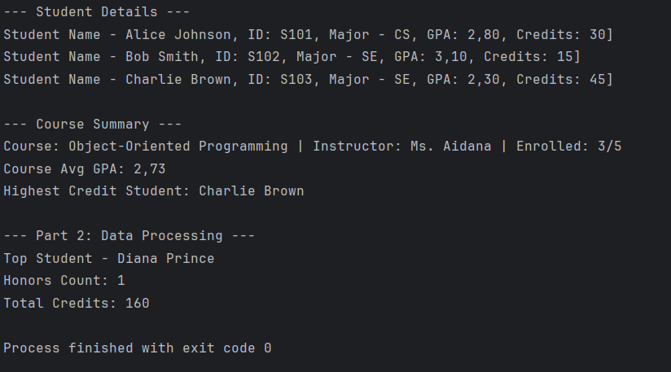

# Assignment 1: Object-Oriented Student Management System

## A. Project Overview
This project is a Java-based Student Management System designed to demonstrate core Object-Oriented Programming (OOP) concepts. The program manages student records, tracks academic performance (GPA, credits), and organizes students into courses.

**Key Goals:**
*   Implement encapsulation using private fields and public getters/setters.
*   Utilize class composition (Course class containing Student objects).
*   Perform array manipulations and data processing.

## B. Class Descriptions

### 1. Student Class
*   **Purpose:** Represents an individual student.
*   **Fields:** `name`, `id`, `major`, `gpa`, `credits`.
*   **Key Methods:**
    *   `updateGPA()`: Updates the student's grade point average.
    *   `isHonors()`: Boolean check to see if GPA is 3.5 or higher.
    *   `addCredits()`: Accumulates credits earned.

### 2. Course Class
*   **Purpose:** Represents an academic course containing a roster of students.
*   **Relationship:** Uses **Composition** (Has-A relationship) by maintaining an array of `Student` objects.
*   **Key Methods:**
    *   `courseAverageGPA()`: Calculates the average GPA of enrolled students.
    *   `highestCreditStudent()`: Finds the student with the most progress.

## C. Instructions to Compile and Run

1. To compile and run code. use this codes in terminal 
  ```bash
   cd src
   ```
  ```bash
   javac *.java
  ```
  ```bash
   java Main
   ```

## D. Screenshots
Here is the execution result of the program:



## E. Reflection Section

**What I Learned:**
I learned how to create classes and objects in Java. I also understood how to use arrays to store multiple students inside a Course object. It was interesting to see how different classes can work together.

**Challenges Faced:**
The hardest part was working with the array of students. I had to remember to check if a student was `null` before calculating the average GPA, otherwise the program crashed. Fixing these errors took some time.

**Benefits of OOP:**
Using `private` fields helped me protect the data, so no one can set a negative GPA. Also, splitting the code into Student and Course classes made the project much easier to read and organize compared to writing everything in one file.